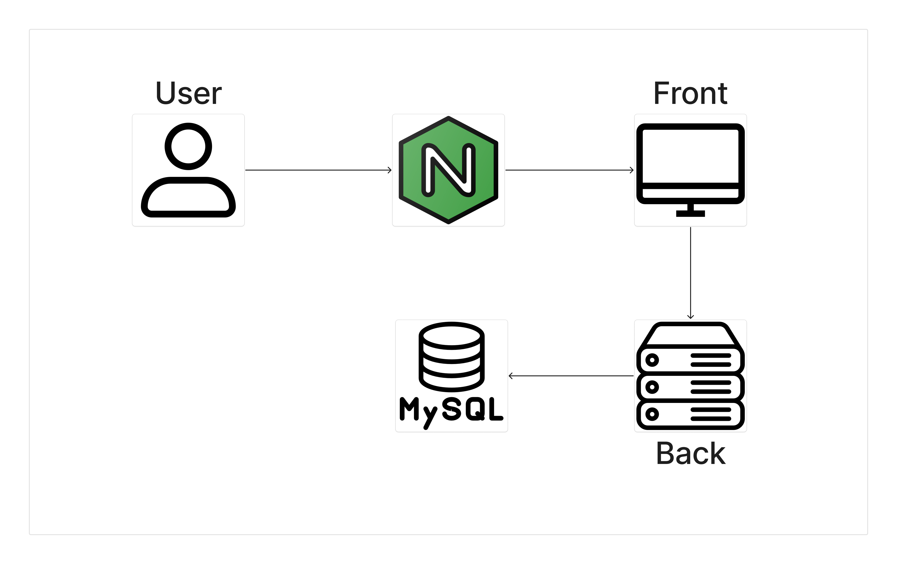

# 실행 방법 메뉴얼

## Docker 활용
**실행 방법**
```
docker-compose up -d
```

<br>

⚠️ **경고:** 해당 URL은 docker-compose를 **로컬에서 실행**했을 때의 URL 입니다.

### Backend(container: backend)
**URL:** http://localhost:8080

**Swagger:** http://localhost:8080/swagger-ui/index.html

### Frontend(container: frontend)
**URL:** http://localhost:3000

### 인프라

FrontEnd 앞에 Nginx를 둠으로써 리버스 프록시와 접근 속도를 개선했습니다.
- **리버스 프록시 역할:** 백엔드 서버 정보를 숨기고, 클라이언트가 직접 접근하지 않도록 보호
- **접근 속도 개선:** 정적 파일을 빠르게 서빙하고, 캐싱을 활용해 응답 속도 향상

<br>

docker-compose 실행시 mysql이 컨테이너로 실행되며 **더미 데이터**가 자동으로 추가 됩니다.

```
INSERT INTO to_do (id, title, content, priority, status, unix_time)
VALUES 
(1, '백엔드 로직 작성', '일정 관리 앱 백엔드 로직 작성', 'HIGH', 'IN_PROGRESS', UNIX_TIMESTAMP('2025-02-14 00:00:00')),
(2, '백엔드 QA', '백엔드 로직 QA 진행', 'MEDIUM', 'NOT_STARTED', UNIX_TIMESTAMP('2025-02-16 00:00:00'));


INSERT INTO to_do_sub (title, content, status, todo_id)
VALUES 
('Mock API 작업', '프론트와 연결을 위한 Mock API 작성', 'COMPLETED', 1),
('Service 작업', '내부 로직 작성', 'IN_PROGRESS', 1),

('Mock API 테스트', 'Mock API 테스트 진행', 'IN_PROGRESS', 2),
('Service 테스트', '내부 로직 테스트 진행', 'NOT_STARTED', 2);
```

## 개별 실행
### 백엔드 실행
**실행 환경** InteliJ

⚠️ 백엔드에 경우 application-local.yml에 값을 **채워넣어줘야** 하며
ddl-auto을 create로 **변경**해야 합니다
```
spring:
  datasource:
    driver-class-name: com.mysql.cj.jdbc.Driver
    url: jdbc:mysql://${mysql}:3306/test?characterEncoding=UTF-8&useUnicode=true&serverTimezone=Asia/Seoul
    username: ${mysqlUser}
    password: ${mysqlPass}

  jpa:
    open-in-view: true
    hibernate:
      ddl-auto: validate -> create
    show-sql: false

logging:
  level:
    org.hibernate.SQL: DEBUG
    org.hibernate.type.descriptor.sql.BasicBinder: TRACE
```

### 프론트 실행
```
cd frontend
npm run dev
```

<br><br>

# 서비스 설명
여러가지 기능으로 사용자의 일정을 **효율적으로 관리** 할 수 있는 서비스 입니다. 

## 일정
사용자의 일정을 관리할 수 있는 서비스로 **우선 사항(Priority)**, **상태(Status)**, **마감 시간**, **제목 및 상세 내용**을 설정 할 수 있습니다.

### 우선 사항(Priority)
사용자의 일정의 **우선 사항**을 나타냅니다. HIGH, MEDIUM, LOW, NONE의 값이 존재하며 의미 하는 바는 다음과 같습니다.

- **HIGH:** 우선 순위가 **가장 높은** 일정
- **MEDIUM:** 우선 순위가 **중간**인 일정
- **LOW:** 우선 순위가 **가장 낮은** 일정
- **NONE:** 우선 순위를 아직 **정하지 않은** 일정

### 상태(Status)
사용자의 일정의 **진행 상태**를 나타냅니다. NOT_STARTED, IN_PROGRESS, COMPLETED의 값이 존재하며 의미 하는 바는 다음과 같습니다.

- **NOT_STARTED:** 아직 일정을 **시작하지** 않음
- **IN_PROGRESS:** 일정을 **진행 중**에 있음
- **COMPLETED:** 일정을 **마무리**함

### 마감 시간
일정을 **효율적으로 관리**가 가능하도록 해당 일정의 마감 시간 설정이 가능합니다.

### 제목 및 상세 내용
일정의 **자세한 내용도 관리**가 가능하도록 해당 일정의 제목과 상세 내용 설정이 가능합니다.


## 하위 일정
사용자의 세부 일정을 관리할 수 있는 서비스로 Parent(상위 일정)의 하위 일정으로 관리 됩니다. 세부 일정은 **Status**와 **제목 및 상세 내용**으로 관리가 가능합니다.

<br><br>

# 사용한 라이브러리
## Vaildation
> implementation 'org.springframework.boot:spring-boot-starter-validation'
- 데이터 유효성 검사를 위한 라이브러리
- 어노테이션을 활용해 유효성 검사를 쉽게 적용하기 위해 사용

## OpenAPI(Swagger)
> implementation 'org.springdoc:springdoc-openapi-starter-webmvc-ui:2.1.0'
- API 문서 자동화 라이브러리
- API 문서를 자동화 함으로 써 비지니스 로직에 집중하기 위해 사용

## Jpa
> implementation 'org.springframework.boot:spring-boot-starter-data-jpa'
- DB와 쉽게 연동하는 라이브러리
- DB에 연동하는 로직을 줄이고 비지니스 로직에 집중하기 위해 사용

## MySQL
> runtimeOnly 'com.mysql:mysql-connector-j'
- MySQL에 연동하기 위한 라이브러리
- MySQL을 쉽게 다루기 위해 사용

## Lombok
>compileOnly 'org.projectlombok:lombok'
>annotationProcessor 'org.projectlombok:lombok'
- 보일러플레이트를 줄여주는 라이브러리
- 개발 생산성을 높이고 불필요한 코드의 길이를 줄이기 위해 사용